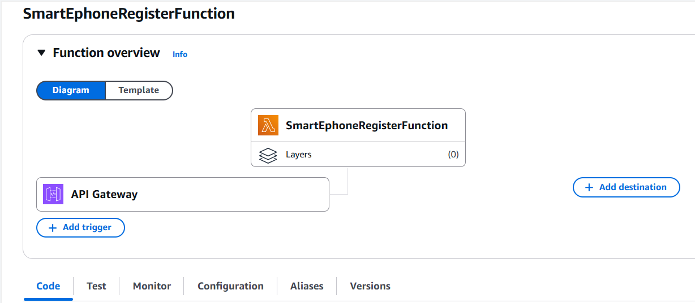
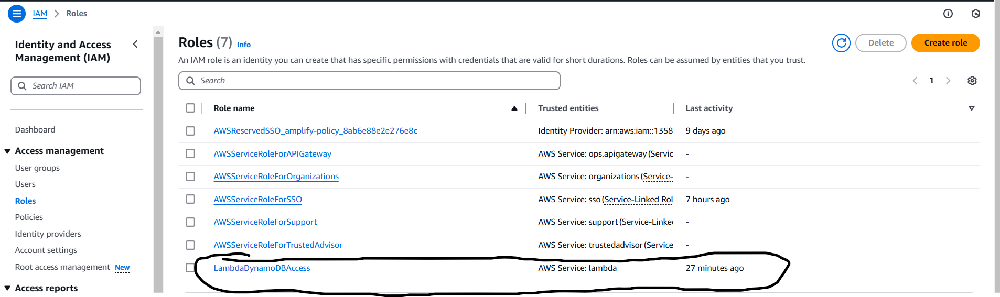
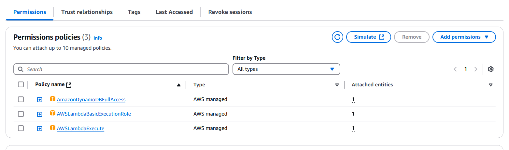
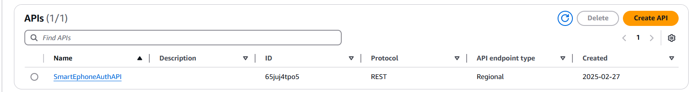
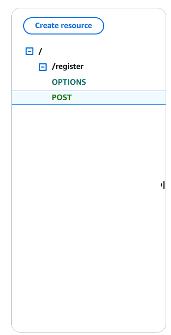
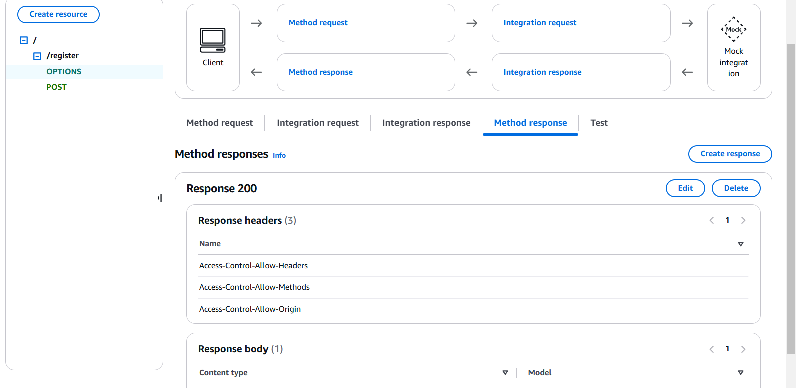
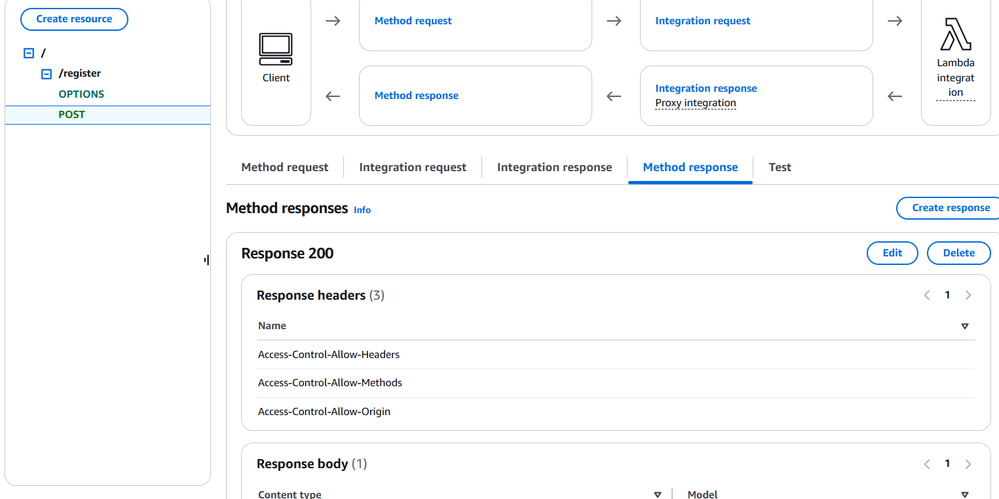
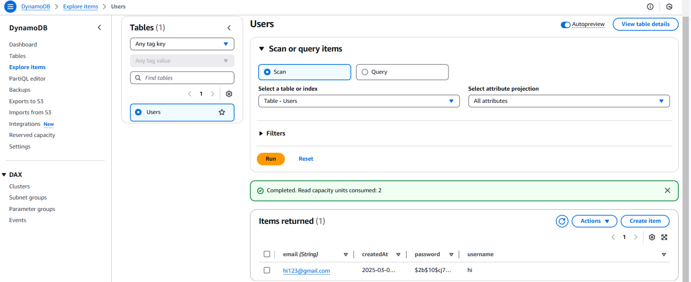

# Serverless-Registration

## Overview
I created an **e-commerce website** using **React.js** and **Tailwind CSS** and deployed it using **AWS serverless services**. This project includes:
- **CI/CD automation with AWS Amplify**
- **DynamoDB for user registration**
- **AWS Lambda for backend logic**
- **API Gateway to manage API requests**

---

## Steps to Deploy

### **1. Upload Project to GitHub**
I uploaded my project to a GitHub repository named **serverless**.  
🔗 [GitHub Repository](https://github.com/mkserrano28/serverless)

---

### **2. Deploy Frontend Using AWS Amplify**
I set up **AWS Amplify** to host my React.js project.  
📌 **CI/CD Enabled**: Every time I push updates to GitHub, **AWS Amplify automatically deploys the latest version** without manual intervention.

#### **AWS Amplify Deployment Screenshot**


---

### **3. Create AWS Lambda for Backend Logic**
I developed an **AWS Lambda function** to handle backend processing and interact with DynamoDB.

#### **AWS Lambda Code and Deployment**
- The Lambda function is responsible for handling user registration.
- It processes API requests and stores data in **DynamoDB**.

📌 **Lambda Function Code Screenshot**  


📌 **Lambda Deployment (ZIP Upload)**  
`lambda_function.zip`

---

### **4. Set Up IAM Role & Policies**
To allow Lambda to interact with **DynamoDB**, I created an IAM role with the necessary permissions.

📌 **IAM Role Configuration Screenshot**  


📌 **IAM Policies for Lambda & DynamoDB**  


---

### **5. Set Up API Gateway**
I created an **API Gateway** to manage and route API requests between my **Lambda function** and **DynamoDB**.

📌 **API Gateway Configuration Screenshots**  
  
  
  
  

---

### **6. Create DynamoDB for User Registration**
I configured **Amazon DynamoDB** to store user registration data. 

📌 **DynamoDB Table Screenshot**  


---

## **Technologies Used**
- **Frontend**: React.js, Tailwind CSS
- **Hosting & CI/CD**: AWS Amplify, GitHub
- **Backend**: AWS Lambda (Node.js)
- **Database**: Amazon DynamoDB
- **API Management**: Amazon API Gateway
- **Infrastructure**: Serverless Architecture

---

## **Future Enhancements**
- Implement authentication using **Amazon Cognito**.
- Add **GraphQL API** for more efficient data querying.
- Improve UI/UX for better user experience.

---

## **How to Run Locally**
1. **Clone the repository**:
   ```sh
   git clone https://github.com/mkserrano28/serverless.git
   cd serverless
