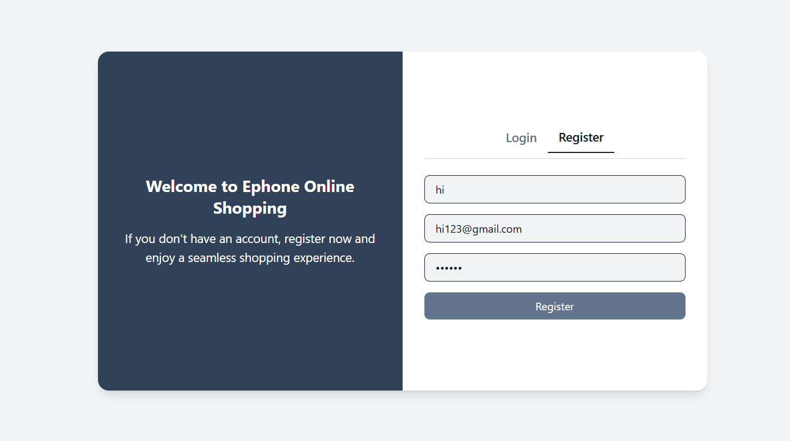

# Serverless-Registration

## Overview
I created an **e-commerce website** using **React.js** and **Tailwind CSS** and deployed it using **AWS serverless services**. This project includes **CI/CD automation**, **DynamoDB for user registration**, **AWS Lambda for backend logic**, and **API Gateway** for managing API requests.

---

## Steps to Deploy

### **1. Upload Project to GitHub**
I uploaded my project to a GitHub repository named **serverless**:  
🔗 [GitHub Repository](https://github.com/mkserrano28/serverless)

---

### **2. Deploy Frontend Using AWS Amplify**
I set up **AWS Amplify** to host my React.js project.  
📌 **CI/CD Enabled**: Every time I push updates to GitHub, **AWS Amplify automatically deploys the latest version** without manual intervention.

#### **AWS Amplify Registration Screenshot**


---

### **3. Create DynamoDB for User Registration**
I configured **Amazon DynamoDB** to store user registration data.


---

### **4. Create AWS Lambda for Backend Logic**
I developed an **AWS Lambda function** to handle backend processing and interact with DynamoDB.

🖼️ *(Insert Lambda Function Screenshot Here)*

---

### **5. Set Up API Gateway**
I created an **API Gateway** to manage and route API requests to my **Lambda function** and **DynamoDB**.

🖼️ *(Insert API Gateway Screenshot Here)*

---

## **Technologies Used**
- **Frontend**: React.js, Tailwind CSS
- **Hosting & CI/CD**: AWS Amplify, GitHub
- **Backend**: AWS Lambda (Node.js)
- **Database**: Amazon DynamoDB
- **API Management**: Amazon API Gateway
- **Infrastructure**: Serverless Architecture

---

## **Future Enhancements**
- Implement authentication using **Amazon Cognito**.
- Add **GraphQL API** for better data querying.
- Improve UI/UX for a better user experience.

---

## **How to Run Locally**
1. Clone the repository:
   ```sh
   git clone https://github.com/mkserrano28/serverless.git
   cd serverless
